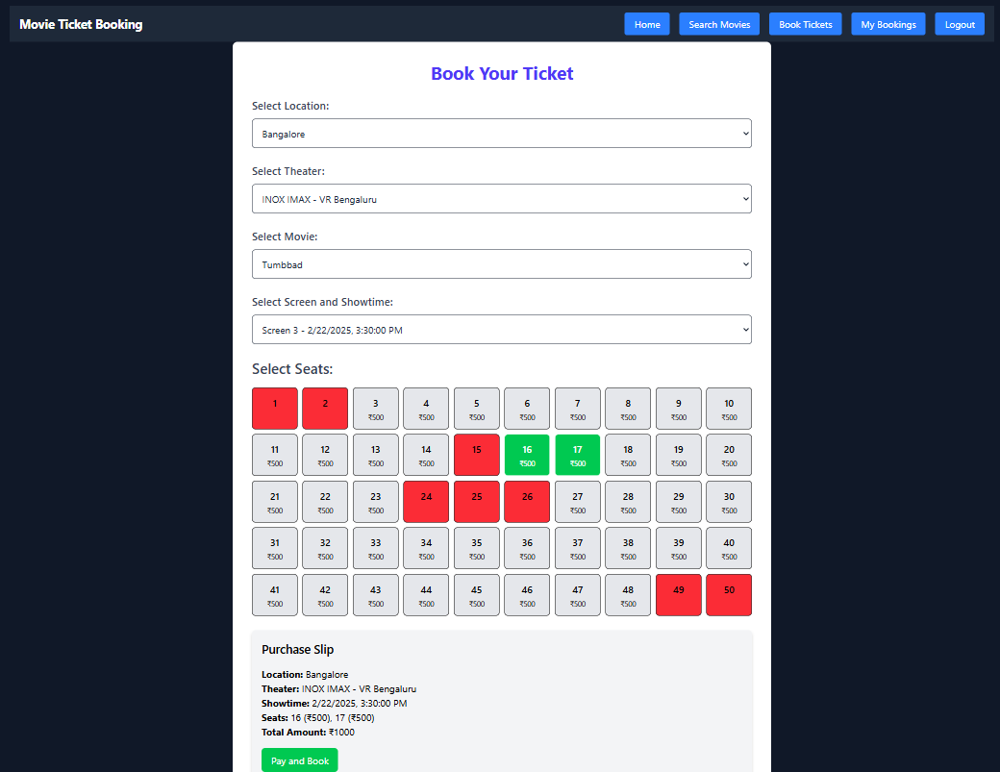

# MovieTicketBookingApp
Welcome to the MovieTicketBookingApp! This application allows users to browse and book tickets for their favorite movies seamlessly. With an intuitive interface and robust backend, it ensures a smooth and enjoyable experience for all users.

## Author
Made by: Aman Kumar Gupta  
Email: 21uec023@lnmiit.ac.in, kumar.aman1406@gmail.com

## Installation
Follow the steps below to install all the dependencies for both the server (backend) and client (frontend) of the project.

### Server (Backend)
1. Navigate to the server directory:
    ```bash
    cd server
    ```
2. Install the required dependencies:
    ```bash
    npm install
3. Install other dependencies if needed:
    npm install <dependency-name>

### Client (Frontend)
1. Navigate to the client directory:
    ```bash
    cd client
    ```
2. Install the required dependencies:
    ```bash
    npm install
3. Install other dependencies if needed:
    npm install <dependency-name>

Now you are ready to run the MovieTicketBookingApp!

## Running the Application
To run the client and server individually, use the following command in their respective directories:
```bash
npm run dev
```

## Screenshots
Here are some screenshots of the MovieTicketBookingApp to give you a glimpse of its interface and features:

### Movie Details
### Admin - Movie Management


### Admin - User Management


### User - Ticket Booking


### User - Login
[Login](login.png)

### User - Register


### User - Home


### User - Search Movies


### MyBookings


These screenshots showcase the user-friendly design and functionality of the app.
